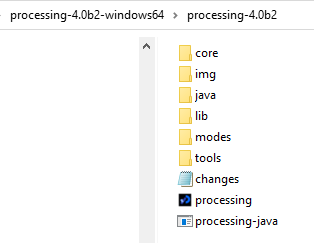

# FlappyBirdPlus
Creating a flappy bird spin off game to learn how to use processing.org

In order to run this game you need to download processing.org from https://processing.org/download (82 KB)

This seems to be depreciated                                                                                                                                                          
You must also have the image files in the right file path. You need to create an img folder int the \processing-4.0b2-windows64\processing-4.0b2 folder which you get from the download above. It should look like this image if done correctly.

You may need to move the img folder from this github folder to the folder mentioned above.
